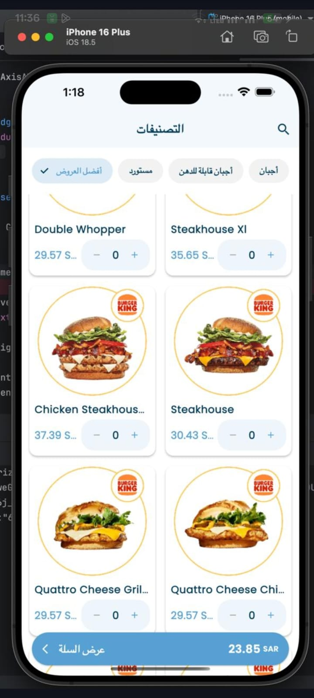
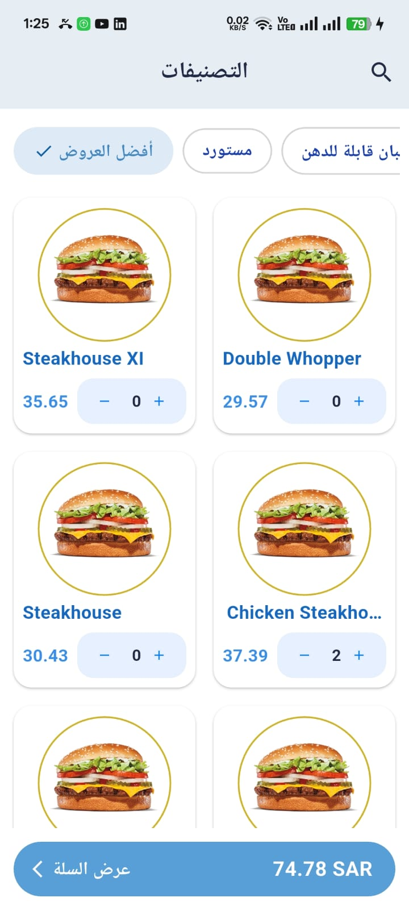

# KartNgo Flutter Task

## Side-by-Side Screenshot

| Original Design                         | Our Flutter App Implementation  |
| --------------------------------------- | ------------------------------- |
|  |  |

---

## Demo App (Kindly click on the image below to watch the video)

## ProxyAI Prompts Used

### 1. Project Structure & Layers

**Prompt:**

> Create the recommended folder structure and initial files for a Flutter app using the Provider architecture. Organize the code into logical layers: screens/ for UI screens, models/ for data models (I will use SQLite), data/ for data sources or repositories, providers/ for state management, widgets/ for reusable UI components. Please generate the necessary Dart files (with basic class stubs and comments) in each folder to establish a clean project foundation.

**Integration:**

- Used ProxyAI to generate the initial folder structure and stubs for models, data, providers, screens, and widgets. This provided a clean, scalable foundation for the app.

### 2. Data Model, SQLite, and Provider

**Prompt:**

> Generate a Product data model for a food ordering app, and set up the SQLite data access layer using the sqflite package. Include a DAO class for CRUD operations and a repository class to abstract data access. Then, create a Provider/ViewModel to manage state and expose data to the UI.

**Integration:**

- ProxyAI generated the Product model, ProductDao, AppRepository, and ProductProvider. These were directly integrated and connected to the UI using Provider for state management.

### 3. UI Implementation

**Prompt:**

> Implement the main product listing UI using Provider and MVVM pattern, matching the provided screenshot. Include RTL support, filter chips, product grid, and a bottom cart bar. Use Consumer for ProductProvider. Show loading indicator if isLoading is true. Use placeholder images and mock data if needed.

**Integration:**

- ProxyAI generated the HomeScreen, FilterChipRow, and ProductCard widgets, closely matching the original design. The UI was refined iteratively to achieve pixel-perfect accuracy.

### 4. Refactor Code into Widgets

**Prompt:**

> now refactor this @home_screen.dart code and store it in @/widgets to match the MVVM model architecture principle

**Integration:**

- ProxyAI extracted the filter chip row and product card logic into reusable widgets (`FilterChipRow` and `ProductCard`) in the `widgets/` directory. The HomeScreen was updated to use these widgets, improving code organization and maintainability.

---

## Notes

- The app uses Provider for state management and SQLite for local data storage.
- All UI elements, including filter chips, product cards, and the cart bar, were refactored into reusable widgets for maintainability.
- The screenshots above demonstrate the visual match between the original design and the implemented Flutter app.
